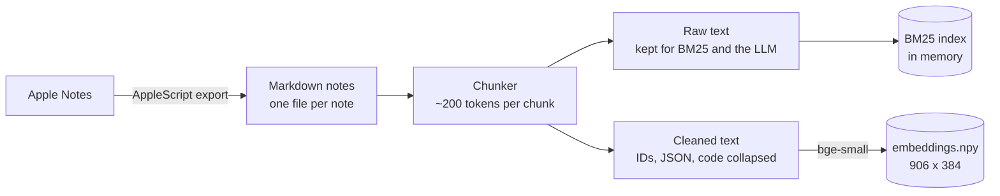
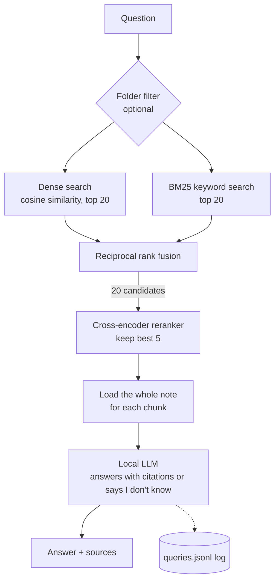

# rag-practice

A retrieval-augmented generation (RAG) pipeline built **by hand** over my own work notes,
to learn how each stage works. No RAG frameworks or vector databases: plain Python and
NumPy, a local embedding model, a local reranker and a local LLM. BM25, cosine similarity,
rank fusion and the chunker are all written from scratch.

The goal is understanding, not a leaderboard score. Every stage is added on its own and
measured against a small eval set, so you can see what each technique fixes and where it fails.

> The notes are private, so `data/` is git-ignored and everything runs locally.

## How it works

### Indexing (offline, once)



### Answering a question



**Embed small, return big:** search runs over small chunks so matches are precise, but the LLM
gets each matched note in full, so it sees the context around the match.

## Quickstart

Requires macOS (for the Notes exporter), Python (built with 3.14) and [Ollama](https://ollama.com).

```bash
python -m venv venv && source venv/bin/activate
pip install -r requirements.txt
ollama pull qwen3.5:9b

# 1. Export notes (reads Apple Notes; resumes if interrupted)
python src/export_work_notes.py

# 2. Build the index
python src/build_chunks.py     # data/notes -> data/index/chunks.jsonl
python src/embed.py            # chunks -> data/index/embeddings.npy

# 3. Ask questions
streamlit run app.py           # UI at http://localhost:8501
python src/answer.py "What's the status of <ticket>?" --folder "Work Notes"

# 4. Evaluate retrieval
python eval/run_eval.py --mode rerank --name my-run
```

Run everything from the repo root. The Streamlit app only listens on localhost and has usage
telemetry turned off.

## The pipeline, stage by stage

| Stage | What it does | Key decision |
|---|---|---|
| **Export** | Apple Notes → one Markdown file per note, with date/folder/title front matter | AppleScript (JXA is broken on recent macOS). Fixed two HTML-conversion bugs that created fake headings and a blank line between every bullet. |
| **Chunking** | Groups each top-level bullet with its sub-items, packs them to ~200 tokens | Size in **tokens**, not words: these notes average ~1.8 tokens/word, and IDs or code go far higher. A 498-word chunk was 4,363 tokens. |
| **Embed clean, keep raw** | Each chunk stores `text` (raw) and `embed_text` (cleaned) | 23% of tokens were machine noise (UUIDs, base64, JSON, pasted HTML). That noise is collapsed to `[N lines of IDs/data]` for the vector, but kept for keyword search and the LLM. |
| **Dense search** | `BAAI/bge-small-en-v1.5`, brute-force cosine in NumPy | ~900 chunks: a matrix-vector product is under a millisecond. No vector DB needed. |
| **BM25** | Hand-written keyword ranking over raw text + header | Tokenizer keeps IDs like `ABC-1234` whole and also indexes their parts. Query stopwords are required (see lessons). |
| **Fusion** | Reciprocal rank fusion of the dense and BM25 lists | Uses ranks, not scores, because cosine and BM25 scores aren't comparable. |
| **Reranking** | `BAAI/bge-reranker-base` re-scores the 20 fused candidates, keeps 5 | Reads question and chunk *together*, so it judges relevance much better than either retriever. |
| **Answer** | Whole notes → `qwen3.5:9b` via Ollama's HTTP API | Must cite `[n]` after every fact, prefer newer notes, and reply "I don't know" when the notes don't cover it. |
| **Folder filter** | Optional metadata filter on every index | Applied *before* ranking, so the top k all come from that folder. |
| **Logging** | One JSON line per question in `data/logs/queries.jsonl` | Question, retrieved chunk ids and scores, sources, answer, time per stage. |

## Results

Retrieval eval on 15 hand-written questions (13 answerable, 2 unanswerable) covering exact IDs,
paraphrases, facts that changed over time, answers spread across days, and folder-specific
questions. **hit@5** = an expected note is in the top 5; **recall@5** = share of expected
notes in the top 5.

| Retrieval | hit@5 | recall@5 |
|---|---|---|
| Dense only | 9/13 | 0.56 |
| BM25 only | 11/13 | 0.76 |
| Hybrid (RRF) | 10/13 | 0.63 |
| **Hybrid + reranker** | **13/13** | **0.92** |

It's a small set written while reading the notes, so read this as "each step clearly helps",
not as a benchmark.

## What I learned

- **Words aren't tokens.** Measure chunk size with the embedding model's own tokenizer. Too-long
  chunks get silently truncated, and here that hit 26 of 707 chunks.
- **Clean what you embed, keep what you search.** An embedding of 69 UUIDs means nothing, but
  keyword search and the LLM may need the exact string.
- **Dense search misses exact IDs; BM25 misses paraphrases.** Each failed on different questions.
- **IDF depends on the collection.** In terse bullet notes, words like "does" or "what" are
  *rare*, so BM25 rated "does" above the product name in the question. Query stopwords fixed it.
- **BM25 matches exact word forms only.** "names" doesn't match "name" (needs stemming), and
  "better" never matches "improved" (needs meaning-based search).
- **Fusion isn't automatically better.** Plain RRF let dense search bury a perfect BM25 match.
- **Reranking is the biggest single win.** Cheap retrievers collect candidates; an expensive
  cross-encoder decides between them.
- **Scores can't detect "no answer".** Unanswerable questions scored higher than some correct
  answers with every method, so "I don't know" has to come from the LLM prompt.
- **Check the eval too.** Two early "misses" were mistakes in the expected answers.

## Project layout

```
src/export_work_notes.py   Apple Notes -> Markdown (AppleScript)
src/build_chunks.py        loader, noise cleaner, token-based chunker
src/embed.py               chunks -> embeddings.npy
src/bm25.py                BM25 index (hand-written)
src/search.py              DenseIndex, HybridIndex (RRF), RerankIndex
src/answer.py              retrieve -> whole notes -> LLM with citations; logging
app.py                     Streamlit UI with sample questions
eval/questions.json        eval questions with expected answers and source notes
eval/run_eval.py           retrieval eval (--mode dense|bm25|hybrid|rerank)
eval/results/              saved eval runs (ids and scores only)
data/                      git-ignored: notes, index, logs
```

## Roadmap

**Done**
- [x] Export notes, fix HTML conversion issues
- [x] Token-based chunking with a cleaned embedding copy
- [x] Dense search + baseline eval
- [x] BM25 + reciprocal rank fusion
- [x] Cross-encoder reranking
- [x] Answers with citations and "I don't know"
- [x] Folder filter, query logging, Streamlit UI

**Next**
- [ ] **Date awareness:** questions like "what's the current status" should prefer the newest note.
  Open question: how much recency should outweigh relevance.
- [ ] **Query rewrite / HyDE / multi-query:** rephrase or expand the question with the LLM
  before searching, for paraphrased questions. Costs an extra LLM call each time.
- [ ] **Answer-level eval:** score answers, not just retrieval, against the expected answers,
  first by hand and then with an LLM judge.
- [ ] **BM25 refinements:** stemming, and measuring chunk length on the cleaned text.
- [ ] **Router and compression:** last, and probably unnecessary at this size.
- [ ] **Postgres + pgvector:** only if this outgrows files (100k+ chunks, several users).
